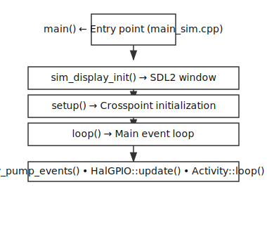

# Crosspoint Native Emulator

Run the [Crosspoint](https://github.com/crosspoint-reader/crosspoint-reader) e-reader firmware on your computer with an SDL2 window (800×480), directory-backed "SD card," and keyboard input. No device or flashing required; useful for UI development and quick iteration.

### Screenshot & demo

| Screenshot | Short demo (video) |
|------------|--------------------|
|  | [Watch **Crosspoint Emulator.mp4**](Crosspoint%20Emulator.mp4) (My Library, grid view, keyboard navigation) |

*Left: My Library grid with book covers and navigation. Right: click the link to play the demo video.*

---

## Table of Contents

1. [Overview](#overview)
2. [Download & Setup](#download--setup)
3. [Setup on macOS](#setup-on-macos)
4. [Setup on Windows](#setup-on-windows)
5. [Building](#building)
6. [Running](#running)
7. [Architecture](#architecture)
8. [New Features in Crosspoint Core](#new-features-in-crosspoint-core)
9. [Usage Guide](#usage-guide)
10. [Troubleshooting](#troubleshooting)
11. [Development](#development)

---

## Overview

The Crosspoint Native Emulator provides a complete simulation environment for the Crosspoint e-reader firmware. It runs the same application code as the physical device, but replaces hardware-specific components (e-ink display, GPIO buttons, SD card) with desktop equivalents:

- **Display**: SDL2 window (480×800, rotated from logical 800×480)
- **Storage**: Local directory (`./sdcard/`) mapped to virtual SD card
- **Input**: Keyboard mapped to device buttons
- **Networking**: Stubbed (WiFi, OTA updates not available)

This allows rapid UI development, testing, and debugging without needing physical hardware or flashing firmware.

---

## Download & Setup

Follow the steps for your operating system below. You need: a **C++17 compiler**, **CMake 3.16+**, **SDL2** (2.x, not SDL3), **Python 3**, **Git**, and the **Crosspoint** repository next to the emulator.

### Setup on macOS

1. **Install Xcode Command Line Tools** (C++ compiler)
   - Open **Terminal** (Applications → Utilities → Terminal, or press `Cmd+Space` and type `Terminal`).
   - Run:
     ```bash
     xcode-select --install
     ```
   - Click **Install** in the dialog. Wait for the install to finish.
   - Verify: `clang --version` (should print a version).

2. **Install Homebrew** (recommended for CMake and SDL2)
   - In Terminal, run:
     ```bash
     /bin/bash -c "$(curl -fsSL https://raw.githubusercontent.com/Homebrew/install/HEAD/install.sh)"
     ```
   - Follow the on-screen instructions. When done, it may ask you to run two `echo` commands to add Homebrew to your PATH — do that.
   - Verify: `brew --version`.

3. **Install CMake**
   - In Terminal:
     ```bash
     brew install cmake
     ```
   - Verify: `cmake --version` (should be 3.16 or higher).

4. **Install SDL2** (must be 2.x, not SDL3)
   - In Terminal:
     ```bash
     brew install sdl2
     ```
   - Verify: `pkg-config --modversion sdl2` (should show a 2.x version).

5. **Install or verify Python 3**
   - macOS often has Python 3 pre-installed. Check: `python3 --version`.
   - If missing: `brew install python3`.

6. **Install or verify Git**
   - Xcode Command Line Tools include Git. Check: `git --version`.
   - If missing: `brew install git`.

7. **Clone the emulator and Crosspoint**
   - Choose a folder (e.g. your home or Desktop). In Terminal:
     ```bash
     cd ~/Desktop
     git clone https://github.com/crosspoint/crosspoint-emulator.git
     cd crosspoint-emulator
     git clone https://github.com/crosspoint-reader/crosspoint-reader.git ../Crosspoint
     ```
   - Replace with your fork URLs if different (Crosspoint firmware: `https://github.com/crosspoint-reader/crosspoint-reader`).
   - The **Crosspoint** repo must be a **sibling** of **crosspoint-emulator** (e.g. `Desktop/crosspoint-emulator` and `Desktop/Crosspoint`).

8. **Build the emulator** (see [Building](#building)): from `crosspoint-emulator` run:
   ```bash
   mkdir -p build && cd build
   cmake ..
   cmake --build .
   ```

---

### Setup on Windows

1. **Install Visual Studio Build Tools** (C++ compiler)
   - Go to: **https://visualstudio.microsoft.com/visual-cpp-build-tools/**  
     (or search “Build Tools for Visual Studio”).
   - Download **“Build Tools for Visual Studio 2022”** (or current year).
   - Run the installer. In the workload list, select **“Desktop development with C++”**.
   - Install. Restart if prompted.
   - Open **Developer Command Prompt for VS** (or **x64 Native Tools Command Prompt**) from the Start menu to use the compiler later, or add it to your PATH.

2. **Install CMake**
   - Go to: **https://cmake.org/download/**  
   - Under **“Latest Release”**, download **Windows x64 Installer** (e.g. `cmake-3.29.x-windows-x86_64.msi`).
   - Run the installer. When asked, choose **“Add CMake to the system PATH for all users”** (or “current user”).
   - Close and reopen any terminal. Verify: `cmake --version`.

3. **Install SDL2** (must be 2.x, not SDL3)
   - Go to: **https://github.com/libsdl-org/SDL/releases**  
   - In the latest **SDL2** release (e.g. 2.30.x), download **`SDL2-devel-2.30.x-mingw.zip`** (MinGW) **or** the **Visual C++** development package if you use MSVC (e.g. `SDL2-devel-2.30.x-VC.zip`).
   - Extract the ZIP to a permanent folder, e.g. `C:\SDL2` — so you have `C:\SDL2\include`, `C:\SDL2\lib`, etc.
   - Remember this path; you will pass it to CMake as `-DSDL2_ROOT=C:\SDL2` (see step 6).

4. **Install or verify Python 3**
   - Download from: **https://www.python.org/downloads/**  
   - Run the installer. **Check “Add Python to PATH”**.
   - Restart the terminal. Verify: `py --version` or `python3 --version`.

5. **Install Git**
   - Go to: **https://git-scm.com/download/win**  
   - Download and run the Windows installer. Use default options (Git in PATH).
   - Verify: `git --version`.

6. **Clone the emulator and Crosspoint**
   - Open **Command Prompt** or **PowerShell**. Go to a folder where you want the repos (e.g. Desktop):
     ```cmd
     cd %USERPROFILE%\Desktop
     git clone https://github.com/crosspoint/crosspoint-emulator.git
     cd crosspoint-emulator
     git clone https://github.com/crosspoint-reader/crosspoint-reader.git ..\Crosspoint
     ```
   - Replace the URLs with your fork if needed. **Crosspoint** must be a **sibling** of **crosspoint-emulator**.

7. **Build the emulator**
   - From the `crosspoint-emulator` folder:
     ```cmd
     mkdir build
     cd build
     cmake .. -DCROSSPOINT_ROOT=%USERPROFILE%\Desktop\Crosspoint -DSDL2_ROOT=C:\SDL2
     ```
   - Use the **actual** path to **Crosspoint** and the path where you extracted **SDL2** (e.g. `C:\SDL2`).
   - Then:
     ```cmd
     cmake --build . --config Release
     ```
   - The executable will be in `build\Release\crosspoint_emulator.exe` (or `build\crosspoint_emulator.exe` depending on generator).

---

### Downloading the Emulator (generic)

If you already have dependencies and only need the repos:

```bash
# Clone the emulator repository
git clone https://github.com/crosspoint/crosspoint-emulator.git
cd crosspoint-emulator

# Clone Crosspoint as a sibling directory (required)
git clone https://github.com/crosspoint-reader/crosspoint-reader.git ../Crosspoint
```

*(Use your fork URLs if different. Crosspoint firmware: `https://github.com/crosspoint-reader/crosspoint-reader`.)*

### Building SDL2 from Source

If you need to build SDL2 manually (e.g., from Downloads folder):

1. **Download SDL2 source** (2.x release, e.g., SDL2-2.30.2):
   ```bash
   # Download from https://github.com/libsdl-org/SDL/releases
   # Extract to ~/Downloads/SDL2-2.30.2
   ```

2. **Build and install**:
   ```bash
   cd ~/Downloads/SDL2-2.30.2
   mkdir build && cd build
   cmake .. -DCMAKE_INSTALL_PREFIX=$HOME/.local
   make -j4
   make install
   ```

3. **Use custom SDL2** when configuring emulator:
   ```bash
   cmake .. -DCROSSPOINT_ROOT=/path/to/Crosspoint -DSDL2_ROOT=$HOME/.local
   ```

---

## Building

### Step-by-Step Build Instructions

1. **Navigate to project directory**:
   ```bash
   cd /path/to/crosspoint-emulator
   ```

2. **Create build directory**:
   ```bash
   mkdir build && cd build
   ```

3. **Configure CMake**:
   
   **If Crosspoint is a sibling directory** (`../Crosspoint`):
   ```bash
   cmake ..
   ```
   
   **If Crosspoint is elsewhere**:
   ```bash
   cmake .. -DCROSSPOINT_ROOT=/absolute/path/to/Crosspoint
   ```
   
   **If using custom SDL2**:
   ```bash
   cmake .. -DCROSSPOINT_ROOT=/path/to/Crosspoint -DSDL2_ROOT=/path/to/SDL2-install
   ```

4. **Build the executable**:
   ```bash
   cmake --build .
   ```
   
   Or use `make` if available:
   ```bash
   make -j4
   ```

5. **Verify build**:
   ```bash
   ls -lh crosspoint_emulator
   # Should show the executable
   ```


### Optional: ArduinoJson Dependency

If you want web server screens to compile (they're stubbed but won't crash):

1. From the Crosspoint repo, run PlatformIO once:
   ```bash
   cd ../Crosspoint
   pio run
   ```
   
   This creates `.pio/libdeps/default/ArduinoJson`, which the emulator CMake will detect and use.

### Build Output

The build process:
- Compiles all Crosspoint application sources (`src/*.cpp`)
- Compiles Crosspoint libraries (GfxRenderer, Epub, Txt, Xtc, fonts, etc.)
- Compiles emulator HAL stubs (`sim/src/*.cpp`)
- Links everything into `crosspoint_emulator` executable

**Build time**: Typically 1-3 minutes depending on hardware.

---

## Running

### Basic Usage

1. **Ensure SD card directory exists**:
   ```bash
   # From project root (not build/)
   mkdir -p sdcard
   ```

2. **Add books to SD card**:
   ```bash
   cp /path/to/book.epub sdcard/
   cp /path/to/book.txt sdcard/
   ```

3. **Run the emulator**:
   ```bash
   # From build directory
   ./crosspoint_emulator
   
   # Or from project root
   ./build/crosspoint_emulator
   ```

4. **Exit**: Close the SDL window (click X or press Alt+F4).

### Running from Different Directories

The emulator automatically detects `./sdcard/` relative to the current working directory. If run from `build/`, it checks `../sdcard/` automatically.

**Recommended**: Always run from project root:
```bash
cd /path/to/crosspoint-emulator
./build/crosspoint_emulator
```

### Keyboard Controls

| Key | Action | Device Button |
|-----|--------|--------------|
| **Arrow Keys** | Navigate | Left / Right / Up / Down |
| **Enter** | Confirm / Select | Confirm |
| **Backspace** or **Escape** | Back / Cancel | Back |
| **P** | Power (hold for sleep in settings) | Power |

### Storage (Virtual SD Card)

The emulator uses `./sdcard/` (relative to current working directory) as the virtual SD card root.

**Supported file formats**:
- **EPUB** (`.epub`) - Full support with metadata, covers, progress tracking
- **TXT** (`.txt`) - Plain text files
- **XTC** (`.xtc`) - Custom format

**Example workflow**:
```bash
# Create SD card directory
mkdir -p sdcard

# Add books
cp ~/Documents/books/*.epub sdcard/
cp ~/Documents/books/*.txt sdcard/

# Organize into folders
mkdir -p sdcard/Novels
mkdir -p sdcard/Technical
mv sdcard/*.epub sdcard/Novels/

# Run emulator
./build/crosspoint_emulator
# Navigate: Home → My Library → Novels → select book
```

---

## Architecture

*Diagrams are generated SVGs. To regenerate after editing: `python3 docs/diagrams/generate_diagrams.py`*

### High-Level Architecture


### Component Flow



### HAL Abstraction Layer

The Hardware Abstraction Layer (HAL) provides a consistent interface between Crosspoint application code and platform-specific implementations:


### Display Pipeline


### Storage Architecture


### Threading Model


The emulator uses a **single main thread**, matching the real device: thumbnail prewarm runs one EPUB per frame with yield points in image generation, so the UI stays responsive. Display and SD access are serialized (shared SPI simulation). See [Real device vs emulator](#real-device-vs-emulator).

### Real device vs emulator

The emulator is built to **behave like the real device** so that timing, responsiveness, and I/O contention match hardware.

**Device hardware (reference)**:
- **CPU**: ESP32 (e.g. ESP32-C3), 160 MHz single core
- **RAM**: 128 MB
- **Storage**: 32 GB microSD included; expansion up to 512 GB supported

**Emulator behavior (matches device)**:

| Aspect | Real device | Emulator |
|--------|-------------|----------|
| **CPU** | Single core: thumbnail generation and UI share one core; yields in image code so the UI can respond. | Single main thread: prewarm runs one EPUB per frame; image conversion yields every 8 rows. |
| **SPI bus** | Display and SD card share one SPI bus; display update and file I/O cannot run concurrently. | Display and SD file I/O use a shared mutex so they are serialized. |

**How the emulator addresses single-core and shared-SPI behavior**

- **Single core:** The emulator does not use a background thread for thumbnail generation. Prewarm runs on the main thread, one EPUB per main-loop iteration, so the UI (event pump and `loop()`) runs between thumbnails. Inside image conversion (e.g. scaling and dithering to BMP), the emulator yields every 8 rows so that even during a single thumbnail the UI can get control. That matches the need to share one 160 MHz core between image work and the UI on the real device.
- **Shared SPI:** On hardware, the display and SD card share one SPI bus, so doing file I/O while the display is updating (or the reverse) is unsafe. The emulator simulates that constraint by serializing all display updates and all SD file operations behind a single mutex: no display transfer and no file read/write run at the same time. The same approach—a shared lock or policy that prevents concurrent display and SD use of the bus—can be applied in the device firmware.

The emulator’s image conversion and SPI handling live in the sim HAL (`image_to_bmp.cpp`, `sim_spi_bus`, `sim_display`, `sim_storage`). To get the same responsive UI and safe bus usage on the real device, the Crosspoint firmware can adopt the same patterns: periodic yields in the device’s thumbnail/image path and a single serialization point for SPI (display and SD) in the device HAL or drivers.

---

## New Features in Crosspoint Core

This section documents the major features and improvements added to the Crosspoint core firmware that are available in the emulator.

### UX Foundation (February 2026)

#### Centralized Constants System

**Problem**: Timing thresholds, button labels, and layout metrics were duplicated across 10+ activity files, leading to inconsistencies and maintenance burden.

**Solution**: Created `UxConstants.h` with centralized definitions:

- **Timing Constants** (`UxTiming::`):
  - `kGoHomeMs` - Long-press duration to return home
  - `kSkipPageMs` - Long-press duration to skip page in library
  - `kChangeTabMs` - Tab switching threshold
  - All timing values defined once, imported everywhere

- **Button Labels** (`UxLabel::`):
  - `kBack` - "« Back"
  - `kHome` - "« Home"
  - `kSelect` - "Select"
  - `kNext` - "Next"
  - `kPrevious` - "Previous"
  - Standardized across all screens

**Impact**: Eliminated 12+ duplicated constant definitions, ensuring consistent UX timing and labels.

#### Screen Consistency Improvements

**Renamed "Browse Files" → "My Library"**
- Clearer, more user-friendly name on Home screen
- Better reflects the visual grid experience

**Standardized Back Button Labels**
- All Back buttons now use `<<` prefix consistently
- Previously mixed: `< Home`, `<< Home`, `<< Back`
- Now unified: `<< Back`, `<< Home` via `UxLabel::` constants

**Improved Empty States**
- **Library**: "No books here. Add files to the SD card."
- **Recents**: "No recent books. Open one from My Library."
- Clear, actionable messaging

**Migration**: 15+ `mapLabels()` call sites migrated to use `UxLabel::` constants.

### Library Grid System

#### Visual Grid Layout

**Feature**: When viewing a folder containing book files, the library displays a **2-column grid** instead of a text-only list.

**Each grid tile shows**:
- **Cover thumbnail** (top) - Generated from EPUB/XTC metadata
- **Title** (below cover) - One or two lines, truncated if needed
- **Progress indicator** (below title):
  - "Not started" - Book never opened
  - "XX%" - Reading progress (0-99%)
  - "Completed" - Finished (100%)

**Folders** appear in the same grid with:
- Folder icon (no cover)
- Folder name
- No progress indicator

**Grid Dimensions**:
- **Columns**: 2 (optimized for 480px width)
- **Tile height**: ~140px (configurable via theme metrics)
- **Rows per page**: 3-4 visible rows
- **Pagination**: Navigate by page for large libraries

#### Progress Tracking Enhancement

**EPUB Progress Format Extension**:

**Previous format** (6 bytes):
```
[spineIndex: 2 bytes][currentPage: 2 bytes][pageCount: 2 bytes]
```

**New format** (8 bytes):
```
[spineIndex: 2 bytes][currentPage: 2 bytes][pageCount: 2 bytes][percent: 2 bytes]
```

**Benefits**:
- Library can show progress **without opening the book**
- Faster library rendering (no EPUB parsing needed)
- Accurate percentage display (0-100)

**Backward Compatibility**: Library detects old 6-byte format and handles gracefully.

#### Memory-Safe Thumbnail Loading

**Optimization**: Only **one thumbnail is loaded at a time** during grid rendering.

**Process**:
1. Theme's `drawLibraryGrid()` iterates through visible items
2. For each book, loads thumbnail BMP from cache
3. Draws thumbnail to framebuffer
4. Releases memory immediately
5. Moves to next item

**Cache Location**: `/.crosspoint/epub_<hash>/thumb_<height>.bmp`

**Prewarm**: Thumbnails are generated on the main thread, one EPUB per loop iteration (`prewarmStep()`), with yield points every 8 rows in image conversion so the UI stays responsive and behavior matches the device.

### Performance Optimizations

#### Thumbnail Prewarm (Main Thread, Device-Fidelity)

**Previous**: Thumbnail generation blocked UI startup until all EPUBs were processed.

**Current**: Prewarm runs on the **main thread**, one EPUB per frame:
- Each loop iteration runs `prewarmStep()` (one EPUB), then `sim_display_pump_events()`, then `loop()`
- Image conversion yields every 8 rows so the UI gets control during long thumbnails
- UI stays responsive; behavior matches the real device (single core, no background thread)

**Implementation**: `main_sim.cpp` runs `prewarmStep()` at the start of each main-loop iteration; image conversion in `image_to_bmp.cpp` calls `yield()` every 8 rows.

#### Framebuffer Rendering Optimization

**Black & White Rendering** (`render_bw_to_texture`):

**Previous**: Processed individual bits, extracting one pixel at a time.

**New**: Processes **8 pixels per byte** (one byte = one horizontal 8-pixel group):
- Reduces loop iterations by **8×**
- More cache-friendly memory access pattern
- Faster rendering

**Grayscale Rendering** (`render_gray_to_texture`):

**Previous**: Per-pixel conditional branching to determine shade.

**New**: Uses **precomputed 8-entry lookup table (LUT)**:
- Index: `(bwBit << 2) | (msbBit << 1) | lsbBit`
- Direct array lookup → shade value
- Eliminates branching, improves performance

#### Image Conversion Optimization

**Ditherer Allocation**:
- **Previous**: Heap-allocated ditherer objects
- **New**: Stack-allocated ditherers

**Row Clearing**:
- **Previous**: `std::fill()` or heap allocation
- **New**: `memset()` for zero-cost clearing

**Impact**: Reduced memory allocations, faster image processing.

### Micro-Interaction Polish

#### Button Press Feedback

**Feature**: `drawButtonHintsWithPress()` added to both Classic and Lyra themes.

**Behavior**:
- Pressed buttons show **inverted style** (filled black background, white text)
- Immediate visual feedback on key press (not just release)
- `pressedIndex` parameter: 0=Back, 1=Confirm, 2=Prev, 3=Next

**Implementation**: Activities call `updateRequired = true` on `wasAnyPressed()` to trigger immediate re-render.

#### Long-Press Progress Indicator

**Feature**: `drawHoldProgress()` displays a thin progress bar during long-press actions.

**Use Cases**:
- Hold-to-go-home in Library
- Hold-to-skip-page navigation
- Any long-press action

**Visual**: Thin horizontal bar fills from 0% to 100% as hold duration increases.

**Implementation**: Called before `displayBuffer()` to show progress overlay.

### Architecture Improvements

#### Shared Utility Functions

**`LibraryProgress::hasUsableThumbBmp()`**:
- Extracted from `HomeActivity` and `MyLibraryActivity`
- Single source of truth for thumbnail availability check
- Used by library grid and home screen

**`LibraryProgress::getEpubProgressPercent()`**:
- Reads 8-byte progress.bin format
- Returns 0-100 percentage
- Handles both old (6-byte) and new (8-byte) formats

**`LibraryProgress::formatProgressLabel()`**:
- Converts percentage to display string
- "Not started", "XX%", or "Completed"
- Consistent formatting across UI

#### Theme System Extensions

**New Theme Methods**:
- `drawLibraryGrid()` - Renders 2-column book grid
- `drawButtonHintsWithPress()` - Button hints with press feedback
- `drawHoldProgress()` - Long-press progress bar

**New Theme Metrics**:
- `libraryCoverHeight` - Thumbnail height (e.g., 120px)
- `libraryTileHeight` - Total tile height including title/progress
- `libraryGridColumns` - Number of columns (typically 2)
- `libraryGridRows` - Rows per page

**Theme Support**: Both `BaseTheme` and `LyraTheme` implement these methods.

### Code Quality Improvements

#### DRY (Don't Repeat Yourself)

- **Before**: Constants duplicated across 10+ files
- **After**: Single source of truth in `UxConstants.h`

#### Single Source of Truth

- **Timings**: All thresholds in `UxTiming::`
- **Labels**: All button labels in `UxLabel::`
- **Layout**: All metrics in `ThemeMetrics` struct

#### Open/Closed Principle

- Extend by adding constants or theme methods
- Don't modify existing signatures without updating all call sites
- New screens follow established patterns

#### Composition Over Inheritance

- Theme drawing uses virtual dispatch on `BaseTheme`
- Activities compose input + render behavior
- No deep inheritance trees

#### Minimize Side Effects

- Data preparation (metadata, progress labels) separate from rendering
- Pure helper functions preferred
- Expensive work (e.g. thumbnail prewarm) is chunked and yields so the main loop stays responsive

---

## Usage Guide

### Navigation Flow


### Library Navigation

**Grid Navigation**:
- **Left/Right**: Move between tiles in same row (wraps at edges)
- **Up/Down**: Move by row (or by one item)
- **Long-press Up/Down**: Skip a page of items
- **Enter**: Open book or enter folder
- **Back**: Return to parent folder or Home

**Grid Display**:
- Shows 2 columns × 3-4 rows per page
- Scrolls by page for large libraries
- One thumbnail loaded at a time (memory-safe)

### Reading Experience

**Reader Features** (same as device):
- Page turning (Left/Right arrows)
- Bookmarking
- Progress tracking (saved to progress.bin)
- Font size adjustment
- Theme switching (Classic/Lyra)

**Progress Persistence**:
- Progress saved automatically when closing book
- Stored in `/.crosspoint/epub_<hash>/progress.bin`
- 8-byte format: spine, page, pageCount, percent

### Settings

**Available Settings** (same as device):
- Display settings
- Reading preferences
- Theme selection
- Power management (stubbed in emulator)

**Note**: WiFi and OTA update settings show but don't function (network stubbed).

---

## Troubleshooting

### Common first-time build issues (e.g. after following Mac instructions)

If you just cloned both repos and ran `cmake --build .` in `build/`, these fixes cover the most frequent problems:

**1. Wrong or broken repo links**

- **Symptom:** Clone fails, or you cloned the wrong repo and the build can’t find Crosspoint.
- **Fix:** Use the correct Crosspoint firmware repo (required sibling of the emulator):
  ```bash
  cd ~/Desktop   # or wherever you have crosspoint-emulator
  cd crosspoint-emulator
  # Clone Crosspoint firmware as a sibling named "Crosspoint" (so CMake finds it by default)
  git clone https://github.com/crosspoint-reader/crosspoint-reader.git ../Crosspoint
  ```
- If Crosspoint is somewhere else, point CMake at it when configuring:
  ```bash
  cd build
  cmake .. -DCROSSPOINT_ROOT=/absolute/path/to/crosspoint-reader
  ```

**2. `fatal error: 'HalStorage.h' file not found`**

- **Symptom:** Build fails with `'HalStorage.h' file not found` (or similar missing HAL header).
- **Fix:** The emulator supplies stubs for device HAL headers (including `HalStorage.h`) in `sim/include/`. Make sure you have the latest emulator so that `sim/include/HalStorage.h` exists:
  ```bash
  cd ~/Desktop/crosspoint-emulator   # your emulator repo
  git pull origin main               # or your default branch
  cd build
  cmake ..
  cmake --build .
  ```
- If the file is present and you still get the error, do a clean reconfigure:
  ```bash
  cd build
  rm -rf *
  cmake ..
  cmake --build .
  ```
- If your Crosspoint fork uses a different `HalStorage` API, you may need to edit `sim/include/HalStorage.h` in the emulator to match (the stub forwards to the SD card manager).

**3. Build still fails after the above**

- Confirm layout: from the emulator repo root, `../Crosspoint` should exist and contain Crosspoint source (e.g. `src/`, `lib/`).
- See [Build Issues](#build-issues) below for CMake, SDL2, and other errors.

### Build Issues

**CMake not found**:
```bash
# macOS
brew install cmake
# Or download from cmake.org

# Linux
sudo apt-get install cmake
```

**SDL2 not found**:
```bash
# macOS
brew install sdl2

# Linux
sudo apt-get install libsdl2-dev

# Verify
pkg-config --modversion sdl2
```

**Crosspoint repo not found**:
```bash
# Ensure Crosspoint is cloned
git clone https://github.com/crosspoint-reader/crosspoint-reader.git ../Crosspoint

# Or set CROSSPOINT_ROOT
cmake .. -DCROSSPOINT_ROOT=/absolute/path/to/Crosspoint
```

**Compilation errors**:
- Ensure C++17 compiler (check: `g++ --version` or `clang++ --version`)
- Clean build: `rm -rf build && mkdir build && cd build && cmake ..`

**`HalStorage.h` (or other HAL header) not found**:
- See [Common first-time build issues](#common-first-time-build-issues-eg-after-following-mac-instructions) above for step-by-step fixes (pull latest emulator, clean rebuild, and when to edit the stub).

### Runtime Issues

**Window doesn't appear**:
- Check SDL2 installation: `pkg-config --libs sdl2`
- Verify executable: `./build/crosspoint_emulator`
- Check for error messages in terminal

**Keyboard input not working**:
- Ensure SDL2 window has focus (click on it)
- Check keyboard mapping in `sim/src/sim_gpio.cpp`
- Verify SDL2 event pumping is working

**SD card not found**:
- Ensure `./sdcard/` directory exists (relative to CWD)
- Check permissions: `ls -la sdcard/`
- Verify files are readable: `ls sdcard/*.epub`

**Books don't appear in library**:
- Verify files are in `sdcard/` (not `sdcard/`)
- Check file extensions: `.epub`, `.txt`, `.xtc`
- Ensure files are readable: `file sdcard/book.epub`

**Thumbnails not generating**:
- Check cache directory: `ls -la .crosspoint/`
- Verify EPUB files are valid: try opening in another reader
- Check terminal for [SIM] prewarm messages

### Performance Issues

**Slow rendering**:
- Ensure optimized build: `cmake .. -DCMAKE_BUILD_TYPE=Release`
- Check SDL2 hardware acceleration: `SDL_RENDERER_ACCELERATED` flag
- Monitor CPU usage: may be normal for complex screens

**High memory usage**:
- Normal: emulator uses host heap (not limited like device)
- Check for memory leaks: use `valgrind` or similar
- Thumbnails are loaded one at a time (should be low memory)

---

## Development

### Project Structure


### Key Files

**`sim/src/main_sim.cpp`**:
- Entry point (`main()`)
- Initializes SDL2 display
- Calls Crosspoint `setup()`, then each loop iteration: `prewarmStep()`, `sim_display_pump_events()`, `loop()`

**`sim/src/sim_display.cpp`**:
- SDL2 window management
- Framebuffer → texture conversion
- Rendering pipeline

**`sim/src/sim_gpio.cpp`**:
- Keyboard → button mapping
- Button state tracking
- Press/release detection

**`sim/src/sim_storage.cpp`**:
- Virtual SD card (directory mapping)
- FsFile implementation
- SDCardManager implementation

### Adding Features

**Adding a new screen**:
1. Create activity class inheriting from `Activity`
2. Include `util/UxConstants.h` for timing/labels
3. Implement `loop()` and `render()`
4. Add press feedback: `if (mappedInput.wasAnyPressed()) updateRequired = true;`
5. Use `GUI.drawButtonHintsWithPress()` for button hints

**Adding HAL functionality**:
1. Add header to `sim/include/` (match device HAL)
2. Implement in `sim/src/`
3. Ensure API matches device HAL exactly
4. Update CMakeLists.txt if adding new source files

**Debugging**:
- Use `Serial.printf()` for logging (goes to terminal)
- Check SDL2 error messages: `SDL_GetError()`
- Verify HAL calls match device behavior

### Architecture Rulebook

See [Architecture & UX Rulebook](#architecture--ux-rulebook) section in README for design principles.

**Key Principles**:
1. **DRY** - No duplicated constants or helpers
2. **Single source of truth** - Centralized definitions
3. **Open/closed** - Extend without modifying
4. **Composition over inheritance** - Prefer composition
5. **Minimize side effects** - Pure functions preferred
6. **Performance budget** - No blocking main loop

---

## Architecture & UX Rulebook

### Design Principles

These rules apply to every change in both the emulator and Crosspoint repos:

1. **DRY** — No duplicated constants, labels, or helper functions. Shared values live in `UxConstants.h` or `LibraryProgress.h`.
2. **Single source of truth** — Timings (`kGoHomeMs`, `kSkipPageMs`, `kChangeTabMs`), labels (`UxLabel::kBack`, etc.), and layout metrics (`ThemeMetrics`) are defined once and imported everywhere.
3. **Open/closed** — Extend by adding new constants or theme methods; don't modify existing signatures without updating every call site.
4. **Composition over inheritance** — Theme drawing is virtual-dispatch on `BaseTheme`; activities compose input + render behavior without deep inheritance trees.
5. **Minimize side effects** — Data preparation (metadata, progress labels) is separate from rendering. Pure helper functions preferred.
6. **Performance budget** — No blocking work on the main loop. Expensive operations are chunked (e.g. one EPUB per frame for prewarm, yields in image conversion) or done lazily so the main loop stays responsive.

### Shared Constants Location

| File | Contents |
|------|----------|
| `Crosspoint/src/util/UxConstants.h` | Timing thresholds (`UxTiming::*`), common button labels (`UxLabel::*`) |
| `Crosspoint/src/components/themes/BaseTheme.h` | `ThemeMetrics` struct with all layout constants |
| `Crosspoint/src/util/LibraryProgress.h` | Progress helpers, shared `hasUsableThumbBmp()` |

### Preferred Interaction Patterns

- **Button hints** must use `UxLabel::` constants for standard labels. Context-specific labels (e.g. "Clear", "Retry") stay inline.
- **Long-press actions** show a hold-progress bar via `GUI.drawHoldProgress(renderer, percent)`.
- **Press feedback** is delivered via `GUI.drawButtonHintsWithPress(...)` with a `pressedIndex` (0=Back, 1=Confirm, 2=Prev, 3=Next).
- Activities call `updateRequired = true` on `wasAnyPressed()` so press feedback renders immediately.

### Performance Rules

- **Thumbnail prewarm** runs on the main thread (`main_sim.cpp`), one EPUB per frame with yields in image conversion, so the UI loop stays responsive and behavior matches the device.
- **Framebuffer-to-texture** processes bytes (8 pixels at a time), not individual bits (`sim_display.cpp`).
- **Grayscale rendering** uses a precomputed LUT instead of per-pixel branching.
- **Image conversion** stack-allocates ditherers and uses `memset` for row clearing instead of `std::fill` or heap allocation.

### Adding a New Screen

1. Create your activity class inheriting from `Activity` (or `ActivityWithSubactivity`).
2. Include `util/UxConstants.h` — use `UxTiming::` for hold/skip thresholds and `UxLabel::` for standard labels.
3. In `loop()`, add `if (mappedInput.wasAnyPressed()) updateRequired = true;` for press feedback.
4. In `render()`, compute `pressedHint` and call `GUI.drawButtonHintsWithPress(...)`.
5. For long-press actions, call `GUI.drawHoldProgress(renderer, percent)` before `displayBuffer()`.

---

## Maintenance

When the Crosspoint HAL or `main.cpp` changes, the sim HAL in `sim/include/` and `sim/src/` may need updates so APIs and behavior stay in sync (see plan in the Crosspoint repo).

---

## Changelog

### UX Overhaul (Feb 2026)

**UX Foundation**
- Created `UxConstants.h` with centralized timing constants (`kGoHomeMs`, `kSkipPageMs`, `kChangeTabMs`) and shared button labels (`UxLabel::kBack`, `kHome`, `kSelect`, etc.).
- Eliminated 12+ duplicated constant definitions across 10 activity files.

**Screen Consistency**
- Renamed "Browse Files" to "My Library" on the Home screen for clarity.
- Standardized all Back button labels to use the `<<` prefix consistently (was mixed: `< Home`, `<< Home`, `<< Back`).
- Improved empty state messages in Library ("No books here. Add files to the SD card.") and Recents ("No recent books. Open one from My Library.").
- Migrated 15+ `mapLabels()` call sites to use `UxLabel::` constants.

**Performance**
- Thumbnail prewarm runs on the main thread, one EPUB per frame with yields in image conversion — UI stays responsive and behavior matches the device (single core, no background thread).
- Optimized `render_bw_to_texture`: processes framebuffer bytes (8 pixels at a time) instead of individual bit extraction, reducing loop iterations ~8x.
- Optimized `render_gray_to_texture`: uses a precomputed 8-entry LUT for grayscale mapping instead of per-pixel conditional branching.
- Eliminated heap allocation in image converter: ditherers are now stack-allocated; row clearing uses `memset`.

**Micro-Interaction Polish**
- Added `drawButtonHintsWithPress()` to both Classic and Lyra themes — pressed buttons show inverted (filled black, white text) for immediate visual feedback.
- Added `drawHoldProgress()` — a thin progress bar appears during long-press actions (e.g., hold-to-go-home in Library).
- All key activities (Home, Library, Recents, Settings, Reader Menu) now trigger re-render on button press, not just release.

**Architecture Cleanup**
- Extracted duplicated `hasUsableThumbBmp()` from HomeActivity and MyLibraryActivity into shared `LibraryProgress::hasUsableThumbBmp()`.
- Documented architecture rulebook and extension guidelines in README.

---

## Contributing

We welcome contributions! To help us keep Crosspoint Emulator clean and consistent, please follow these steps:

1. **Fork and Clone**: Fork the repo and clone your version locally.
2. **Branch**: Create a new branch for your feature or bugfix:  
   `git checkout -b your-feature-description`
3. **Code Style**:  
   - Follow current code structure and naming conventions.  
   - Use C++17 features (but no newer).
   - Keep UI logic in activities or themes as appropriate.  
   - Centralize constants in `UxConstants.h` or relevant header.
4. **Testing**:  
   - Test on your platform (macOS, Windows, or Linux).
   - Make sure the emulator builds (`cmake`, `make`) and runs without errors.
   - If changing UI, verify both Classic and Lyra themes.
5. **Commits**:  
   - Write clear, descriptive commit messages.
   - Squash trivial commits before submitting a PR.
6. **Pull Request**:  
   - Open a pull request on GitHub describing:
     - What the change does
     - Which files are affected
     - How to test/review it

Please be patient—reviews may take a few days. For major features or refactors, open an issue first to discuss plans.

Thank you for helping improve Crosspoint Emulator!

---

## Acknowledgments

Built on top of the [Crosspoint](https://github.com/crosspoint-reader/crosspoint-reader) e-reader firmware project.
